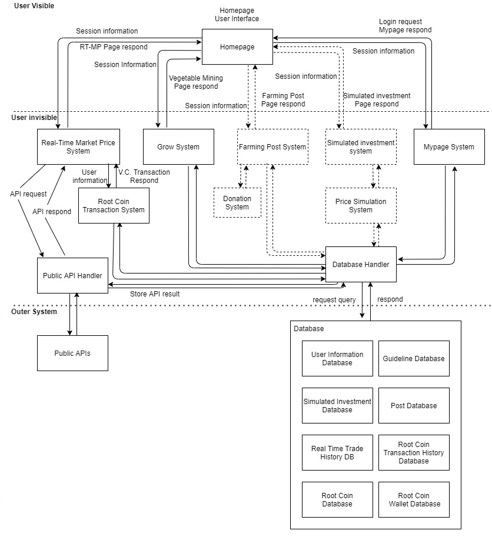
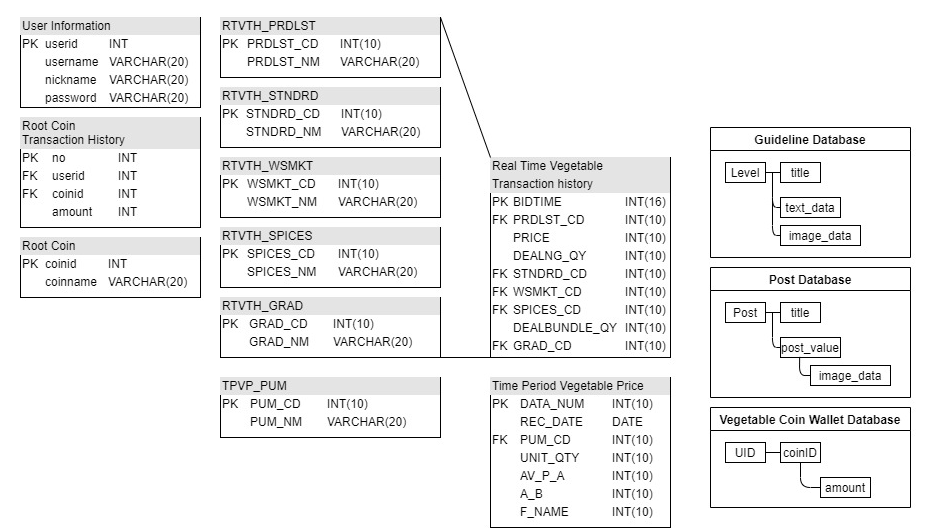

# coin-backend

0. Introduction
루트코인은 집에서 값 비싼 채소를 직접 기르는, 일명 "파테크"를 도와주는 서비스입니다.    
공공 API를 활용하여 농산물의 시세를 확인하고, 직접 집에서 재배하려는 많은 도전자분들을 도와주기 위해 개발된 서비스입니다.    

1. 서비스 구조도     

2. DB 구조도    

3. 사용법
- `git clone <url>`
- `npm install`
- `npm start`