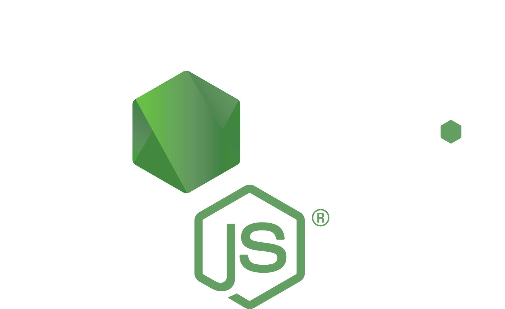

# RootCoin-backend

<h3> :leafy_green: Introduction</h3>

루트 코인은 집에서 값 비싼 채소를 직접 기르는, 일명 "파테크"를 도와주는 서비스입니다.

공공 API를 활용하여 농산물의 시세를 확인하고, 직접 집에서 재배하려는 많은 도전자분들을 도와주기 위해 개발된 서비스입니다.

<h3>:leafy_green:서비스 구조도</h3>     

- 전체적인 서비스의 구조에 대한 설명이 담긴 개념도입니다.
- 발전 가능성이 있는 분야들은 점선으로 표시되어 있습니다. 구현이 되어있는 부분은 실선으로 표시되어 있습니다.

<h6>:leafy_green:DB 구조도</h6>    

<h3>:leafy_green:기술 스택</h3>

| React                                                        | Node.js                    | AWS Lambda                                                   | AWS DynamoDB                                                 |
| ------------------------------------------------------------ | -------------------------- | ------------------------------------------------------------ | ------------------------------------------------------------ |
|  |  |  |  |

<h3>:leafy_green:사용법</h3>

- `git clone <url>`
- `npm install`
- `npm start`

